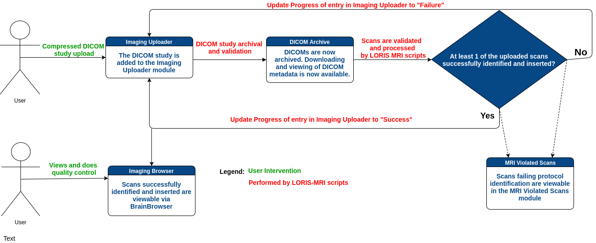

# 1.0 - Introduction

### 1.1 What is LORIS-MRI? 

LORIS-MRI comprises the core libraries for loading and inserting imaging 
data in LORIS. 
It is maintained in a separate repository so that it can be installed 
on the file server and separated from the web server.
These documents assume you have some knowledge regarding LORIS and
a functioning installation of the core LORIS codebase. For information 
regarding LORIS itself, please consult the [LORIS wiki][1].

LORIS-MRI is a set of libraries, scripts, and settings responsible for the 
insertion, organization, and archiving of uploaded imaging datasets. 
It expects an uploaded, compressed file containing 
a [DICOM][2] scan session composed of many DICOM files. These DICOM files 
will be archived on the server and converted to [MINC][3] and (optionally)
[NIfTI][4] files. Knowledge of these file formats can be helpful, but are not 
necessary for using or installing LORIS-MRI.

LORIS-MRI allows you to easily organize and archive your imaging datasets
and links them with corresponding behavioral data in LORIS. Scans can be viewed 
and quality controlled in the LORIS front end via web browser, facilitating 
collaboration between radiologists, clinicians and researchers.

### 1.2 How does LORIS-MRI work? 
 

LORIS-MRI allows multiple ways to upload scans, but typically, users
upload a compressed (.tgz, .tar.gz, or .zip) DICOM folder via the Imaging
Uploader module that should be composed of **only** DICOM files. LORIS requires 
that the uploaded file name follow the naming convention 
`PSCID_CANDID_VISIT-LABEL`. 
In addition, all DICOM datasets uploaded via the Imaging Uploader or 
transferred on the LORIS-MRI server must be free of any identifying 
information (*e.g.* patient name). A tool can be provided to the sites to 
facilitate de-identification. Please contact the LORIS team for details.

The LORIS-MRI pipeline starts once the scans are uploaded to the server.
The pipeline can start automatically if the autolaunch configuration is
set, otherwise a back-end administrator can manually run the pipeline. 
These options and scripts are detailed in the 
[Pipeline Triggering Options documentation](05-PipelineLaunchOptions.md). 

Insertion progress can be tracked by the user through the Log Viewer in the
Imaging Uploader module, where descriptive messages can be consulted.
The output of the main key steps in the insertion progress can also be consulted 
through:
 - the LORIS DICOM Archive module for successfully archived DICOM datasets 
 - the Imaging Browser module for MINC files (generated from DICOM) that pass the 
study-defined MRI protocol 
 - BrainBrowser using 3D or 4D navigation of these MINC files. More details on 
BrainBrowser's capabilities can be found [here.][5]

[1]: https://github.com/aces/Loris/wiki 
[2]: http://dicomiseasy.blogspot.ca/2011/10/introduction-to-dicom-chapter-1.html
[3]: https://en.wikibooks.org/wiki/MINC/Introduction 
[4]: https://nifti.nimh.nih.gov/ 
[5]: https://brainbrowser.cbrain.mcgill.ca/
