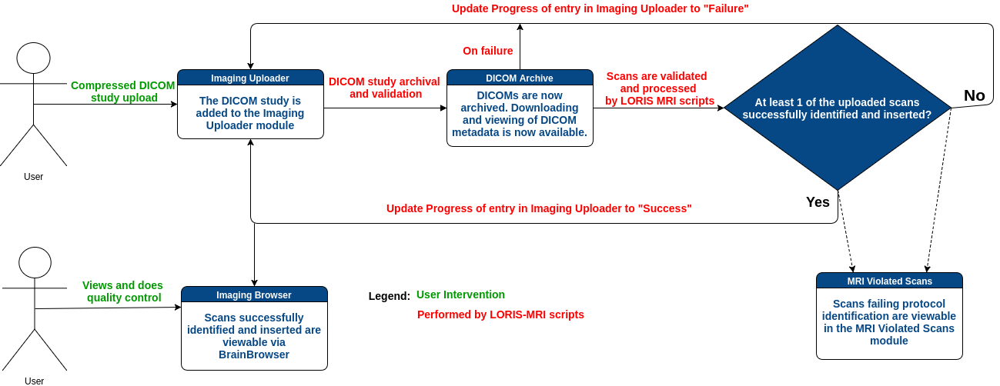

# 1.0 - Introduction 

### 1.1 What is LORIS-MRI?
LORIS-MRI is the backbone of the imaging component that makes up LORIS. 
These documents assume you have some
knowledge regarding LORIS and a functioning installation. For information
regarding LORIS itself, please consult the [LORIS wiki][1].

LORIS-MRI is responsible for the processing, visualizing, and archiving
of uploaded MRI scans. It expects an uploaded, compressed file containing
several [DICOM][2] files, processes this into [MINC][3] and [NII][4]
files, and then archives these files onto the server. Knowledge of
these file formats can be helpful, but are not necessary for using or
installing LORIS-MRI.

LORIS-MRI allows you to easily organize and archive your MRI data and links it with 
 corresponding behavioral data in LORIS. Scans can be viewed and quality controlled through the user's web browser, facilitating collaboration between radiologists, clinicians and researchers. 

### 1.2 How does LORIS-MRI work?

First, users upload a compressed (.tgz, .tar.gz, or .zip) DICOM folder to Imaging Uploader.
LORIS requires that the uploaded file name follow the naming convention PSCID_CANDID_VISIT-LABEL.
Assuming the upload went through successfully, an entry is added to the menu of Imaging Uploader
and the upload's status throughout the pipeline can then be tracked by
the user through the Log Viewer.

The LORIS-MRI pipeline starts once the scans are uploaded to the server.
The pipeline can start automatically if the autolaunch configuration is set, otherwise
 manual intervention is required by a developer with backend access to the server
 (information on the scripts needed to run the pipeline can be found
 in the Scripts section of the documentation).

 First, the upload is prepped to be archived on the server. The study
 participant's data included in the upload (**DICOM headers?**) is crosschecked and
 validated with the LORIS database. Given that all uploaded metadata is valid, the
 DICOM upload is archived on the server. The archival can be viewed and downloaded
 through LORIS' DICOM Archive module.

 Following archival, the scans are copied into MINC and (optionally) NII
 file formats. At this stage, scan parameters such as echo time, repetition time, etc.,
 are checked with the MRI protocol table in the LORIS database to determine the scan types.

If at either the archival or processing stages of the pipeline there is a failure,
the scan(s) will be inserted into the MRI Violations LORIS module where details
of the faulty scan can be viewed. If at least one scan successfully passes
through the pipeline, the Progress column in Imaging Uploader is set to success, and
the successfully processed scans are now viewable in Imaging Browser. Each scan is
 then available to be navigated in BrainBrowser in 3D or 4D space. More details
 on the capabilities of BrainBrowser can be found [here.][5]

[1]: https://github.com/aces/Loris/wiki 
[2]: http://dicomiseasy.blogspot.ca/2011/10/introduction-to-dicom-chapter-1.html
[3]: https://en.wikibooks.org/wiki/MINC/Introduction 
[4]: https://nifti.nimh.nih.gov/
[5]: https://brainbrowser.cbrain.mcgill.ca/
