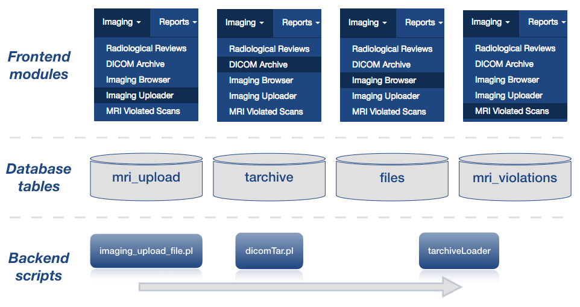

# 2.0 - Install

## 2.1 Dependencies and installation

Dependencies and installation information are documented on the LORIS-MRI
  [README.md](../README.md) file.


## <a name="configuration"></a> 2.2 Configuration

Following a successful install, some configurations and customizations are 
needed and outlined in the next three sub-sections.

### 2.2.1 Database

The following tables in the database need to be configured properly for the 
insertion pipeline to successfully insert scans.

1. **`psc`** table

The `MRI_alias` field must be populated for each site that is scanning 
candidates or phantoms.

2. **`Visit_Windows`** table

To populate with visit labels, you can manually insert study-specific information:


      INSERT INTO Visit_Windows (Visit_label,  WindowMinDays, WindowMaxDays, OptimumMinDays, OptimumMaxDays, WindowMidpointDays) VALUES ('V1', '0', '100', '40', '60', '50');

If age is not a critical factor in study visit scheduling, define `Min` value as 
`0`, and `Max` value as `2147483647` (maximum `int`).


Alternatively, LORIS provides a PHP script called `populate_visit_windows.php` 
in its `tools/` directory that can be used.


4. **`mri_scan_type`**, **`mri_protocol`** and **`mri_protocol_checks`** tables

> - `mri_scan_type`: this table is a lookup table that stores the name of
the acquisition (*e.g.* t1, t2, flair...). Do not include commas, hyphens,
spaces or periods in your `mri_scan_type.Scan_type` column values. The ID
present in this table will be used in the `mri_protocol` and
`mri_protocol_checks` tables described below.

> - `mri_protocol`: this table is used to identify incoming scans based
on their series description **OR** scan parameter values (TE, TR,
slice thickness, etc). By default, this table is populated with entries for t1,
t2, fMRI and DTI, and the columns defining expected scan parameters
(*e.g.* `TE_min`, `TE_max`) are defined very broadly.

> - `mri_protocol_checks`: this table allows further checking on the acquisition
once the scan type has been identified in order to flag certain scans based on
additional parameters found in the header. For example, let's say a scan has been
identified with the `mri_protocol` table to be a `t1`. Additional headers could
be checked in order to flag with a caveat or exclude the scan based on the value
of that header.

**Behaviour of the `*Min` and `*Max` columns of the `mri_protocol` and
`mri_protocol_checks` tables:**

> - if for a given parameter (*e.g.* TR) a `*Min` **AND** a `*Max` value have
been specified, then it will check if the parameter of the scan falls into the
range \[Min-Max].

> - if for a given parameter, a `*Min` is provided but not a `*Max` then the
imaging pipeline will check if the parameter of the scan is higher than
the `*Min` value specified in the table.

> - if for a given parameter, a `*Max` is provided but not a `*Min` then the
imaging pipeline will check if the parameter of the scan is lower than
the `*Max` value specified in the table.

> - if for a given parameter, both `*Min` and `*Max` are set to `NULL`, then
there will be no constraint on that header.


5. **`Config`** table

The `Config` table can also be accessed and customized from the LORIS front-end
via the `Configuration` module, accessible under the `Admin` menu. Here are the 
configuration settings that impact directly or indirectly the pipeline:

Under the `Study` section:
 * `ImagingUploader Auto Launch`: used by the Imaging Uploader to automatically launch the insertion scripts on the uploaded scan
 
Under the `Paths` section: 
 * `LORIS-MRI Code`: where the LORIS-MRI codebase is installed; typically `/data/$PROJECT/bin/mri/`
 * `MRI-Upload Directory`: where the uploaded scans get stored; typically `/data/incoming/`
 * `Images`: where the images displayed in Imaging Browser are stored; typically `/data/$PROJECT/data/`
 
Under the `Imaging Modules` section: 
  * `Patient ID regex`: used by the DICOM Archive module to show/hide the PatientID info
  * `Patient name regex`: used by the DICOM Archive module to show/hide the Patient Name info
  * `Lego phantom regex`: used by the DICOM Archive module to show/hide the Patient Name info for phantoms
  * `Living phantom regex`: used by the DICOM Archive module to show/hide the Patient Name info for phantoms
  * `Imaging Browser Tabulated Scan Types`: used by Imaging Browser's main page which lists the different imaging sessions across candidates. This setting will determine which modalities will have their QC status displayed in that listing page
     
Under the `Imaging Pipeline` section: 
 * `LORIS-MRI Data Directory`: directory where imaging data is stored;
    typically `/data/$PROJECT/data/`
 * `Study Name`: prefix to be used in all filenames inserted into the `files`
    table and visible in the front-end via the Imaging Browser module
 * `User to notify when executing the pipeline`: user email address to be used when
    notification is to be sent by the pipeline
 * `Full path to get_dicom_info.pl script`: typically `/data/$PROJECT/bin/mri/dicom-arhive/get_dicom_info.pl`
 * `Horizontal pictures creation`: specifies whether or not argument -horizontal
    should be used by mincpik when generating pictures to be displayed in Imaging Browser
 * `NIfTI file creation`: used to enable or disable automated NIfTI file creation
 * `dcm2mnc binary to use when converting`: allows the user to specify the binary
    file to be used when converting DICOM files to MINC. The default setting is to 
    use the binary provided by the MINC tools, namely `dcm2mnc`
 * `Path to Tarchives`: directory where the original DICOMs are archived;
    typically `/data/$PROJECT/data/tarchive/`
 * `Patient identifiers and center name lookup variable`: DICOM header that
    contains the LORIS candidate identifiers; typically `PatientName`
 * `Upload creation of candidates`: enable or disable candidate creation into LORIS
    when running the insertion pipeline
 * `Project batch management used`: enable or disable batch management
 * `Number of volumes in native DTI acquisitions`: used by the DTIPrep pipeline
 * `Scan type of native T1 acquisition`: name as specified in the `mri_scan_type`
    table. Used by the DTIPrep pipeline
 * `Max number of DTI rejected directions for passing QC`: maximum number of
    directions that can be removed from a DTI scan to pass QC. Used by the DTIPrep pipeline
 * `NIAK Path`: Path to NIAK if MINC diffusion is to be run. Used by the DTIPrep pipeline
 * `Secondary QCed dataset`: path where a secondary QC'ed dataset is to be stored. Used by the DTIPrep pipeline
 * `Series description to exclude from imaging insertion`: series descriptions to be 
    excluded from the steps of the pipeline that start at, and follow the DICOM to 
    MINC conversion. Note that the series description entered in that field needs to
    be an exact match of what is present in the DICOM series description field.
 * `ComputeDeepQC`: enable or disable the automated computation of image quality
    control. Feature to be integrated in the code base in a **future** release.
 * `Name of the MRI config file`: name of the MRI config file to use when running
    the Perl insertion scripts; typically `prod`; used when Auto launch is turned on.
 * `Default visit label for BIDS dataset`: the visit directory in BIDS 
    structure is optional in the case of only one visit for the whole dataset. In
    this case, we need to specify to LORIS what would be the default visit label 
    the project wants to use to store the electrophysiology datasets (*e.g.* V01).
 * `Name of the environment file`: name of the MRI environment file to source before
    running the insertion scripts; typically `environment`; used when Auto-launch
    is turned on for the pipeline.
 * `Modalities on which SNR should be calculated`: list of modalities/scan types on 
    which to compute SNR; typically all 3D images
 * `Scan type to use as a reference for defacing (typically T1W image)`: scan type
    name of the modality to use as a reference for defacing
 * `Modalities on which to run the defacing pipeline`: list of modalities/scan types
    on which the defacing algorithm should be run; typically any scan showing the 
    face of the candidate
    

### 2.2.2 LORIS

1. **Imaging Uploader**


Projects can upload scans and launch the pipeline in a variety of options 
detailed in the [PipelineLaunchOptions](05-PipelineLaunchOptions.md) section. 
Irrespective of the project's choice as to whether the imaging scan is to be 
uploaded through the Imaging Uploader GUI or not, pipeline insertion progress 
can be consulted through a live 'Log Viewer' panel.
Some settings need to be configured properly (`php.ini` variables, 
`MRI-Upload Directory` and `ImagingUploader Auto Launch`), and are documented in 
the [LORIS repository: Imaging Uploader Specification](https://github.com/aces/Loris/blob/master/modules/imaging_uploader/README.md).


2. **DICOM Archive**

This LORIS module provides a front-end display with the details of the archived 
DICOM study from the database `tarchive_*` tables. The only setting that 
impacts the display of this module are the regex settings in the `Configuration` 
module under the section `Imaging Modules`. These settings determine whether the 
Patient Name/Patient ID header values are displayed in full, or show up as 
**INVALID-HIDDEN**.

More detailed specifications can be consulted in the 
[LORIS repository: DICOM Archive Specification](https://github.com/aces/Loris/blob/master/modules/dicom_archive/README.md).


3. **Imaging Browser**

The Imaging Browser module accesses the screenshot (PIC) images directly from 
the filesystem where they are stored. It also provides the option to download 
some files. Ensure that:
- `/data/$PROJECT` directory and subdirectories are readable and executable by
    the Apache linux user.
- the Configuration module (*Paths*) `Imaging data`, `MINC files` and 
  `Images` settings are set (typically: `/data/$PROJECT/data/`). 
    
More detailed specifications can be consulted in the 
[LORIS repository: Imaging Browser Specification](https://github.com/aces/Loris/blob/master/modules/imaging_browser/README.md).

4. **Brainbrowser**

Brainbrowser displays the MINC images within the browser. It accesses those MINC 
images directly from the filesystem. Ensure that:
- `/data/$PROJECT` directory and subdirectories are readable and executable by
    the Apache linux user.
- the Configuration module (*Paths*) `MINC files` setting is
    `/data/$PROJECT/data/`.
- the `project/config.xml` file (in the main LORIS codebase) contains the
      proper MINC toolkit path in the `<MINCToolsPath>` tagset.
      
More detailed specifications can be consulted in the 
[LORIS repository: Brainbrowser Specification](https://github.com/aces/Loris/blob/master/modules/brainbrowser/README.md).


5. **MRI Violated Scans**

No configuration setting is needed for the MRI Violated Scans module to work. 
Data loaded in this module gets populated automatically by the insertion 
scripts. As such, scans whose parameters can't be matched against the 
`mri_protocol` table during the imaging insertion process, will be flagged as 
protocol violations and will not have their MINC/NIfTI volumes loaded in the 
Imaging Browser module. Violated scans can be viewed and the type of error 
(scan identification, protocol violation) can be reviewed from the front-end.

More detailed specifications can be consulted in the 
[LORIS repository: MRI Violated Scans Specification](https://github.com/aces/Loris/blob/master/modules/mri_violations/README.md).


6. **Electrophysiology Browser**

No configuration setting is needed for the Electrophysiology Browser module. 
Data loaded in this module get populated automatically by the BIDS insertion 
scripts (in the `python` directory). It accesses data stored in the 
`physiological_*` tables.


### 2.2.3 LORIS-MRI 

#### Filesystem

- `/data/*` subdirectories were created by the imaging install script. If not,
    it may be due to `root:root` ownership of the `/data/` mount on your
    system. Ensure these subdirectories are created manually, particularly:
    `/data/$PROJECT/bin/mri/`, `/data/incoming/`, and those inside 
    `/data/$PROJECT/data/`, namely `assembly`, `batch_output`, `logs`,
    `pic`, `tarchive`, and `trashbin`.


- `/data/$PROJECT/` directory and subdirectories must be readable and executable
    by the Apache linux user. It may also help to ensure the `/data/` mount is
    executable. After any modifications, ensure you restart apache.
    
#### Customizable routines in the `prod` file

- `isFileToBeRegisteredGivenProtocol()`

    * By default, any scan will be inserted if it matches an `mri_protocol` 
    table entry.
    * To **whitelist/blacklist** specific scan types -- *e.g.* in the case of 
    protocol exclusion, case sensitivity or labelling variance -- modify the 
    subroutine, *e.g.*:

```perl
if($acquisitionProtocol eq 't1' or $acquisitionProtocol eq 't2' or $acquisitionProtocol eq 'dti' or $acquisitionProtocol eq 'bold' or $acquisitionProtocol =~ /fmri/) { return 1; }
```

- `getSubjectIDs()`

    Routine to parse candidate’s PSCID, CandID, Center (determined from the PSCID), and visit 
    label. 
    
- `get_DTI_CandID_Visit()`

    Used by the DTIPrep pipeline


## <a name="post-installation-checks"> 2.3 Post-installation checks

#### 2.3.1 Make sure the environment file is writable by Apache

To help ensure Apache-writability, verify that your environment file contains
  the following line:

 ```bash
 umask 0002
 ```

#### 2.3.2 Set up MINC utilities for BrainBrowser visualization

To ensure that BrainBrowser can load MINC images, the MINC toolkit must be
  accessible to the main LORIS codebase. (If the LORIS-MRI codebase is
  installed on a separate machine, ensure the MINC toolkit is installed in both
  locations.)

Ensure the `project/config.xml` file (in the main LORIS codebase) contains the
  following tagset, specifying the MINC toolkit path local to the main LORIS
  codebase (`/opt/minc/` in this example):

```xml
<!-- MINC TOOLS PATH -->
<MINCToolsPath>/opt/minc/</MINCToolsPath>
```

#### 2.3.3. Verify filesystem permissions

Ensure that permissions on `/data/$PROJECT`, `/data/incoming` and their
  subdirectories are set such that `lorisadmin` and the Apache linux user can
  read, write _and_ execute all contents.

The following must be recursively owned by the `lorisadmin` user and Apache group:

```bash
/data/$PROJECT/data/
/data/$PROJECT/bin/mri/
/data/incoming/
/data/$PROJECT/bin/mri/dicom-archive/.loris_mri/prod
```

#### 2.3.4 Verify Configuration module settings for Imaging Pipeline

In the LORIS front-end, under the Admin menu, go to the `Config` module.  Verify/set 
the following config settings (examples are shown below for a project named `demo`):

Under the `Imaging Pipeline` section:
 * `LORIS-MRI Data Directory` (typically `/data/$PROJECT/data/`)
 * `Study Name` (`exampleStudy`; this name will be appended as a prefix to the filenames in LORIS' Imaging Browser)
 * `User to notify when executing the pipeline`
 * `Full path to get_dicom_info.pl script`(typically `/data/$PROJECT/bin/mri/dicom-archive/get_dicom_info.pl`)
 * `Path to Tarchives` (typically `/data/$PROJECT/data/tarchive/`)
 * `Default visit label for BIDS dataset`: (`V01` or any visit label fitting)

Under the `Path` section:
 * `LORIS-MRI Code`(typically `/data/$PROJECT/bin/mri/`)
 * `Images` (typically `/data/$PROJECT/data/`)

Click `Submit` at the end of the Configuration page to save any changes.

#### 2.3.5 Troubleshooting guideline

For common errors and frequently asked questions, please refer to the [Appendix
  A](AppendixA-Troubleshooting_guideline.md).


## 2.4 Pipeline flow

### 2.4.1 DICOM insertion (MRI/PET)

The pipeline was initially designed for **raw DICOM MRI data**, collected by a
  longitudinally-organized multi-site study with a defined imaging acquisition
  protocol. With modifications and further customization, it can handle any
  modality of imaging data.

Typically, images insertion into LORIS is performed via the following steps:

1. Upload of a compressed set of the DICOM study via the **Imaging Uploader**
     module (or transfer the compressed DICOM studies directly on the server
     hosting LORIS).
2. DICOM insertion into the `tarchive` tables in order to be able to see the
     information stored in the DICOMs via the **DICOM Archive** module.
3. Conversion of the DICOMs into MINC files for protocol validation and
     insertion into the LORIS database. By default it will also create NIfTI
     images from the MINC files and insert them into LORIS (see the
     [Configuration](#2.2-configuration) section above if you want to disable
     this option). One of two possible actions will follow depending on the
     study-defined protocol:
     
    a. If a scan matches one of the protocol defined in the `mri_protocol`
         table and passes the optional additional file checks present in the 
         `mri_protocol_checks` table, then the MINC image will be stored into 
         the `files` tables. This inserted image is then accessible via the 
         **Imaging Browser** module and can be displayed in 3D using 
         **BrainBrowser**.

    b. If a scan does not match any of the protocol defined in the
         `mri_protocol` table, then the MINC image of this scan will be stored
         in the `mri_protocol_violated_scans` table. Additionally, scans that
         were excluded by the optional criteria defined in the
         `mri_protocol_checks` table will be logged into the
         `mri_violations_log` table. Both types of violated scans are
         then accessible via the **MRI Violated Scans** module and can be
         displayed in 3D using **BrainBrowser**.


The graph below shows the different modules mentioned above with the
  representation of the group of tables described in more details in the
  [Technical Infrastructure](03-TechnicalInfrastructure.md) section. In
  addition, the graph shows the name of the main script that is used to insert
  the images into the LORIS database. More details about those scripts can be
  found in the [Scripts](04-Scripts.md) section.




### 2.4.2 BIDS insertion (Electrophysiology and Imaging)

The pipeline to insert BIDS datasets into LORIS currently support the 
following BIDS modalities/entities:
  - Electroencephalography ('eeg')
  - Magnetic Resonance Imaging ('anat', 'func', 'fmap', 'dwi') 

With slight modifications and further customization, it could handle other 
types of electrophysiology or imaging modalities.

Typically, BIDS data insertion into LORIS is performed via the following steps:

1. Transfer the BIDS-format data to the LORIS server via commandline. Due to the 
large size of electrophysiological/BIDS data, a suitable browser-based uploader is 
not presently available.

2. Run the BIDS import script to import the data into the `physiological_*` tables 
for electrophysiology datasets and into the `file*` tables of LORIS. More details about this import script can 
be found in the [PipelineLaunchOptions](05-PipelineLaunchOptions.md) section.
