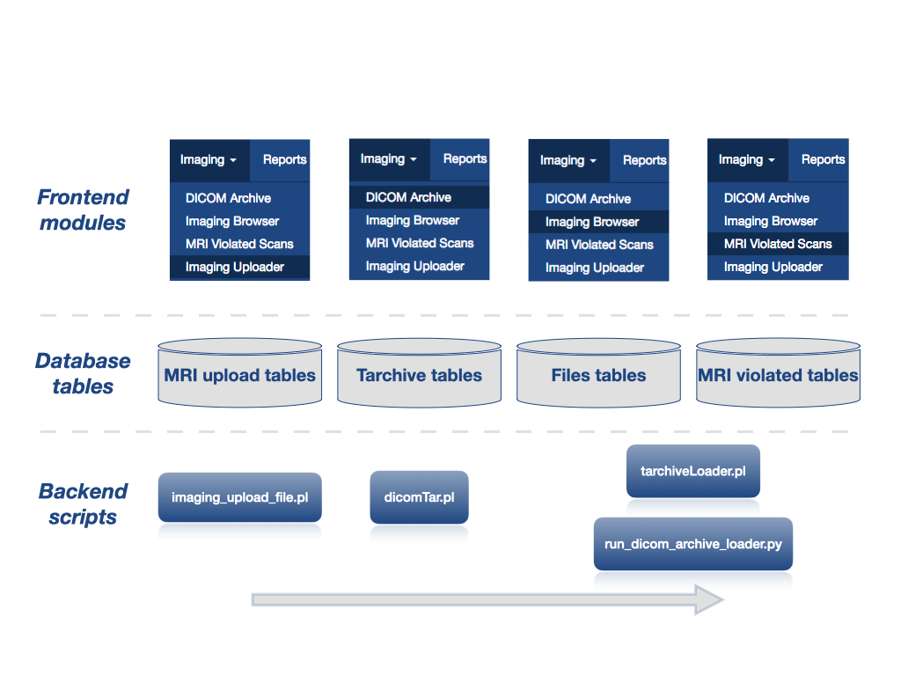

# 2.0 - Install

## 2.1 Dependencies and installation

Dependencies and installation information are documented on the LORIS-MRI
  [README.md](../README.md) file.


## 2.2 Configuration

**NEED TO TALK ABOUT THE CREATION OF NIFTI OPTIONS AS IT IS REFERENCED IN THE
  PIPELINE FLOW DOCUMENTATION.**

## 2.3 Pipeline flow

By default the pipeline is designed for **raw DICOM MRI data**, collected by a
  longitudinally-organized multisite study with a defined data acquisition
  protocol. With modifications and further customization, it can handle any
  modality of imaging data.

Default images insertion into LORIS follows the following steps:

1. Upload of a zip of the DICOM study via the **Imaging Uploader** module (or
     DICOM study transfer directly on the server hosting LORIS).
2. DICOM insertion into the `tarchive` tables in order to be able to see the
     information stored in the DICOMs via the **DICOM Archive** module.
3. Conversion of the DICOMs into MINC files for protocol validation and
     insertion into the LORIS database. By default it will also create NIfTI
     images from the MINC files and insert them into LORIS. See the
     [Configuration](#2.2-configuration) section above if you want to disable
     this option.
     
    a. If a scan matches one of the protocol defined in the `mri_protocol`
         table, then the MINC image will be stored into the `files` tables and
         can be visualized in the **Imaging Browser** module and
         **BrainBrowser**.

    b. If a scan does not match any of the protocol defined in the
         `mri_protocol` table, then the MINC image of this scan will be stored
         into the `mri_protocol_violated_scans` table and can be seen via the
         **MRI Violated Scans** module.


The graph below shows the different modules mentioned above with the
  representation of the group of tables described in more details in the
  [Technical Infrastructure](03-TechnicalInfrastructure.md) section. In
  addition, the graph shows the name of the main script that is used to insert
  the images into the LORIS database. More details about those scripts can be
  found in the section [4 Scripts](04-Scripts.md).



## 2.4 Post-installation checks

#### 2.4.1 Make sure the environment file is writable by Apache

To help ensure Apache-writability, verify that your environment file contains
  the following line:

 ```bash
 umask 0002
 ```

#### 2.4.2 Set up MINC utilities for BrainBrowser visualization

To ensure that BrainBrowser can load MINC images, the MINC toolkit must be
  accessible to the main LORIS codebase. (If the LORIS-MRI codebase is
  installed on a separate machine, ensure the MINC toolkit is installed in both
  locations.)

Ensure the _project/config.xml_ file (in the main LORIS codebase) contains the
  following tagset, specifying the MINC toolkit path local to the main LORIS
  codebase (/opt/minc/ in this example):

```xml
<!-- MINC TOOLS PATH -->
<MINCToolsPath>/opt/minc/</MINCToolsPath>
```

#### 2.4.3. Verify filesystem permissions

Ensure that permissions on /data/$projectname and /data/incoming and their
  subdirectories are set such that lorisadmin and the Apache linux user can
  read, write _and_ execute all contents.

The following must be recursively owned by the lorisadmin user and by Apache
  group:

```bash
/data/$projectname/data/
/data/$projectname/bin/mri/
/data/incoming/
/data/$projectname/bin/mri/dicom-archive/.loris_mri/prod
```

#### 2.4.4 Verify Configuration module settings for Imaging Pipeline

In the LORIS front-end, under the Admin menu, go to the `Config` module. Under
  the section `Imaging Pipeline`, verify/set the following config settings:
 * `Loris-MRI Data Directory`
 * `Study Name`
 * `User to notify when executing the pipeline`
 * `Full path to get_dicom_info.pl script`
 * `Path to Tarchives`

Click 'Submit' at the end of the Configuration page to save any changes.

#### 2.4.5 FAQ

For common errors and frequently asked questions, please refer to the [Appendix
  A](AppendixA-FAQ.md).