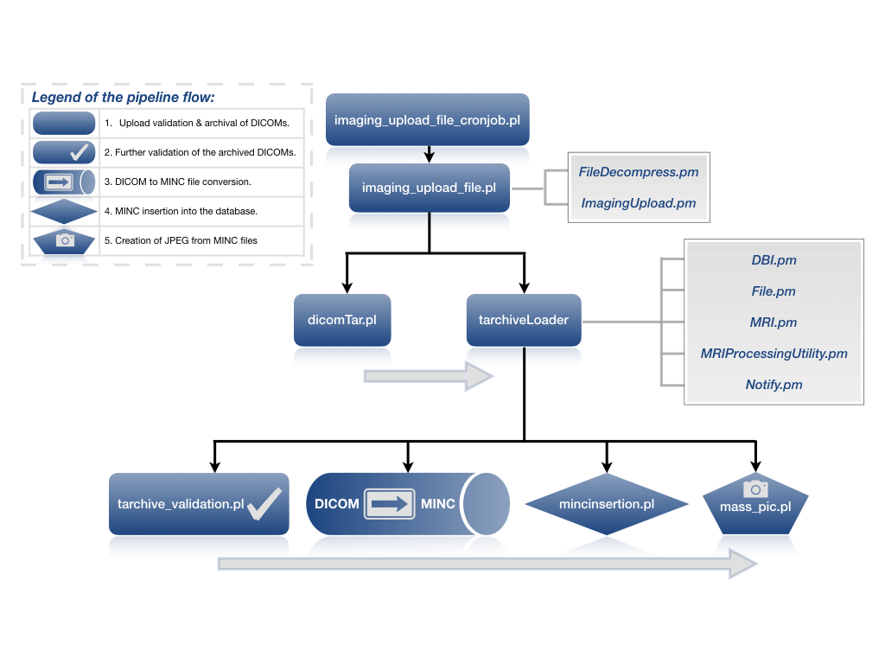

# 3.0 - Install

## 3.1 Dependencies

## 3.2 Setup

## 3.3 Configuration

## 3.4 Pipeline flow

Once a new imaging study has been uploaded via the imaging uploader
  module, several scripts are run automatically or manually in order to
  insert the images into LORIS. The sections below describe an overview
  of the insertion pipeline flow.

#### 3.4.1 Upload validation & archive of DICOMs

The very first step of the pipeline flow is to unzip and check whether
  the uploaded study is valid (correct PatientName, ????????).

#### 3.4.2 Archival of the DICOM study

Once the uploaded study has been validated, the
  `imaging_upload_file.pl` will call `dicomTar.pl` to insert the DICOM
  study into the database and archive it in a .tar file.

#### 3.4.3 tarchiveLoader

After the DICOM study has been archived and inserted into the database
  the `imaging_upload_file.pl` script will call `tarchiveLoader` to

## 3.5 Common errors