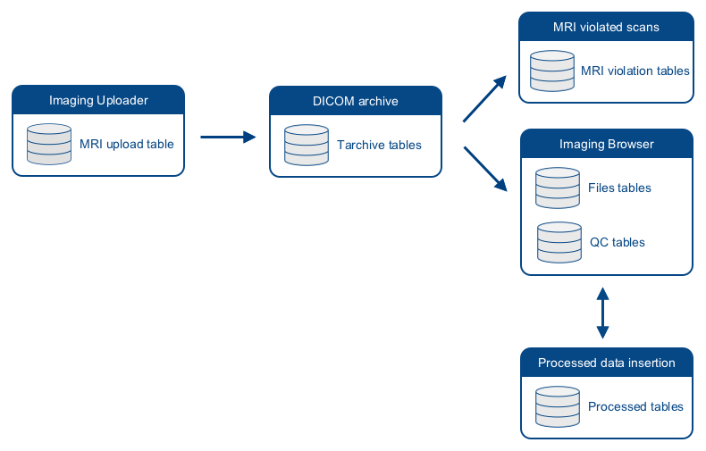
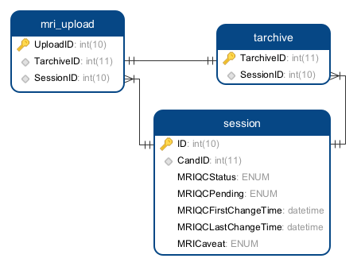
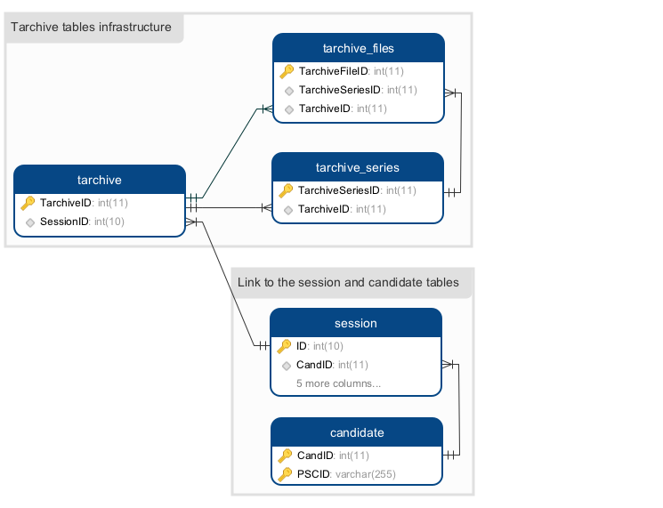
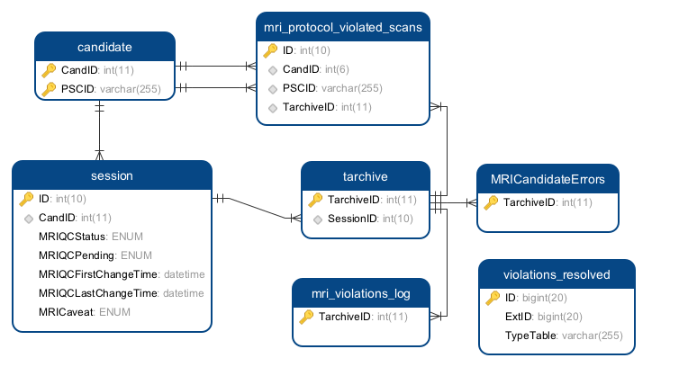

# 3.0 - Technical Infrastructure


## 3.1 Back end directory structure

The root directory of the imaging part of a LORIS instance is typically 
  `/data/$PROJECT`.

```
## Imaging pipeline file directory structure
/
|__ data
    |__ incoming
    |__ $PROJECT
        |__ bin
        |   |__ mri
        |__ data
            |__ trashbin
            |__ tarchive
            |__ pic
            |__ jiv
            |__ logs
            |__ assembly
            |__ batch_output
            |__ pipelines`*`
            |__ protocols`*`
```

`*` _denotes optional directories that are not automatically created by the 
install script_

Within that project directory, there are typically two directories:

- The `bin/mri` directory is a copy of all the imaging scripts downloaded from
    the [GitHub LORIS-MRI repository](https://github.com/aces/Loris-MRI). 
    Details about the content of this folder can be found in the
    [script section](04-Scripts.md).

- The `data` directory stores all the imaging-related data that will be created
    by the imaging scripts. 

The following subsections will describe the content of the different 
  subdirectories found under `/data/$PROJECT/data`.


#### The `assembly` directory

The MINC images that can be viewed via BrainBrowser in the imaging browser 
  module are located under the `data/assembly` directory and organized by 
  `CandID/Visit`. Within each of these visit labels, data are first 
  organized by imaging type (`mri` or `pet` for example) and then by output 
  type (such as `native` or `processed`). For example, a native T1W image for 
  subject 123456's V1 visit will be located in 
  `data/assembly/123456/V1/mri/native/project_123456_V1_T1W_001.mnc`.
    
```
## Content of the /data/$PROJECT/data/assembly directory
.
|__ CandID
    |__ Visit
        |__ mri
        |   |__ native
        |   |   |__ project_CandID_Visit_modality_number.mnc
        |   |__ processed
        |       |__ pipeline_name
        |           |__ nativeFileName_output_number.mnc
        |__ pet
            |__ native
                | project_CandID_Visit_modality_number.mnc
```


#### The `incoming` directory

Incoming scans from the Imaging uploader module (or automatic cron jobs) are 
  stored in an `incoming` directory. Once the pipeline has successfully run,
  data in the incoming folder are removed to avoid duplication of raw imaging
  datasets.
  
  
#### The `jiv` directory

JIV images produced by the imaging insertion pipeline are organized per 
  candidates in the `data/jiv` folder.
    
```
## Content of the /data/$PROJECT/data/jiv directory
.
|__ CandID
    |__ project_CandID_Visit_modality_number_fileid.header
    |__ project_CandID_Visit_modality_number_fileid.raw_byte.gz
```


#### The `logs` directory

The logs of the scripts are created under `data/logs` in `/data/$PROJECT`.
    
```
## Content of the /data/$PROJECT/data/logs directory
.
|__ TarLoad-`xx-xx-xxxxxx`.log
|__ DTIPrep_pipeline`*`
|   |__ DTI_QC`date`.log
|   |__ DTI_QC`date`.log
|__ DTIPrep_register`*`
|   |__ DTIregister`date`.log
|   |__ DTIregister`date`.log
|__ registerProcessed`*`
    |__ registerProcessed`date`.log
    |__ registerProcessed`date`.log
```

`*` _denotes optional directories that are not automatically created by the 
install script_
`HH-MM-xxxxxx` _where `HH` denotes the hour of the insertion, `MM` the 
minutes of the insertion and `xxxxxx` a random alphanumeric string._

#### The `pic` directory

The screenshots displayed in the imaging browser module for each modality is 
  stored within the `data/pic` folder and organized per candidates. 
    
```
## Content of the /data/$PROJECT/data/pic directory
.
|__ CandID
    |__ project_CandID_Visit_modality_number_fileid_check.jpg
    |__ project_CandID_Visit_modality_number_fileid_check.jpg
```  


#### The `pipelines` directory

Processed incoming data or DTIPrep pipeline outputs are stored within 
  the `data/pipelines` directory and organized per pipeline versions, 
  candidates and visit labels. In addition, protocol files for automatic 
  pipelines are saved in the `data/protocols` directory.
    
```
## Content of the /data/$PROJECT/data/pipelines directory
.
|__ DTIPrep
    |__ DTIPrep_version
        |__ CandID
            |__ Visit
                |__ mri
                    |__ processed
                        |__ DTIPrep_XML_protocol_name
                            |__ file.mnc
                            |__ file.nrrd

## Content of the /data/$PROJECT/data/protocols directory
.
|__ protocols
    |__ DTIPrep
        |__ project_DTIPrep_XML_protocol.xml
```


#### The `tarchive` directory
  
The DICOM archives listed in the DICOM archive module are stored in the
  `data/tarchive` directory and organized within folders representing the 
  different years of acquisition.

```
## Content of the /data/$PROJECT/data/tarchive directory
.
|__ year_1
    |__ DCM_`date`_tarchive.tar
    |__ DCM_`date`_tarchive.tar
    |__ DCM_`date`_tarchive.tar
|__ year_2
    |__ DCM_`date`_tarchive.tar
    |__ DCM_`date`_tarchive.tar
    |__ DCM_`date`_tarchive.tar
```

#### The `trashbin` directory

The scans that violates the established imaging protocol and listed in the MRI 
  violated scans module are stored within the directory `data/trashbin`.
    
```
## Content of the /data/$PROJECT/data/trashbin directory
.
|__ Tarload-XX1
    |__ file.mnc
    |__ file.mnc
|__ Tarload-XX2
    |__file.mnc
```
      

## 3.2 Database infrastructure

The database infrastructure is divided in six main components based on the 
  workflow happening from native images insertion to quality control and 
  ultimately insertion of processed datasets.  




### 3.2.1 MRI upload table

Summary information about the imaging upload status can be found in the 
  `mri_upload` table. This includes links to the DICOM archive tables (described 
  in the next section) and to the `session` table. It also includes summary 
  information regarding the upload and the insertion process performed after 
  the upload.




### 3.2.2 Tarchive tables

The first step to insert a new imaging session into the database is the 
  insertion of the DICOM study. In the database, all information related to a
  DICOM study is being organized into three different tables:
 
 * the `tarchive` table stores information about the whole imaging session,
     including patient, scanner and study information, as well as the location 
     of the archived DICOM dataset. Each row correspond to a specific imaging 
     session identified by the DICOM header `StudyUID`.
 * the `tarchive_series` table stores information about each modality that 
     was acquired during the imaging session (T1W, T2W...). This information 
     include imaging parameters such as TR, TE, TI, slice thickness, sequence 
     name... Each row corresponds to a different modality identified by the 
     DICOM header `SeriesUID` and `EchoTime`. This table is linked to the 
     `tarchive` table via the `TarchiveID` foreign key.
 * the `tarchive_files` table stores information about each DICOM found in 
     the imaging session. Each row correspond to one DICOM file and is linked 
     to the `tarchive` table via the `TarchiveID` foreign key and to the 
     `tarchive_series` table via the `TarchiveSeriesID` foreign key.
 


In the front end of LORIS, you can see the DICOM studies using the 
  _DICOM Archive_ module under the _Imaging_ tab. The information displayed in 
  this module comes from the three `tarchive` tables mentioned above.

Note: the `SessionID` field of the `tarchive` table is populated once at least  
  one MINC file derived from that DICOM study got inserted in the tables 
  described in 3.2.3.


### 3.2.3 Files tables

The second step to insert a new imaging session into the database is the 
  conversion of the DICOM study into the MINC files that will be inserted based 
  on the imaging protocol used. Having the dataset converted in MINC allows 
  visualization of the images directly in the browser.
  
Once all MINC files are created (via the `dcm2mnc` converter from the MINC tools), 
  the backend scripts will pull the information stored in the following tables 
  in order to identify the scan type each MINC file created:
  
  * the `mri_scan_type` table stores the name of the scan type linked 
      along with the `ID` field that will be used to identify the scan type
  * the `mri_protocol` table stores each scan type's parameters that will 
      be used to identify the scan type (TR, TE, TI, slice_thickness...)
  * the `mri_protocol_checks` table stores additional protocol checks 
  	   after an acquisition has been identified in order to automatically flag 
  	   some acquisitions based on information stored in specific DICOM headers
  
Every MINC file that matches the protocol defined in the tables mentioned above 
  will be inserted in the database using the following tables:
  
  * the `files` table contains the information about the MINC file itself 
      (its location, the identified scan type, the file type...). Each row 
      correspond to one MINC file identified by the `SeriesUID` and `EchoTime` 
      header information.
  * the `parameter_file` table contains all the information stored in the 
      MINC header. Each row in that table stores a combination of a specific 
      header for a specific MINC file. This table is linked to the `files` 
      table using the foreign key `FileID` and to the `parameter_type` 
      table using the foreign key `ParameterTypeID`. Note: The `parameter_type` 
      table is automatically populated with the insertion of the first MINC
      file in the database and stores the data dictionary for each MINC header 
      field.
  * the `ImagingFileTypes` table contains the different file format that
      can be inserted into the `files` table (`.mnc`, `.txt`, `.xml`...). The 
      field `type` of the table `ImagingFileTypes` is linked to the `FileType` 
      field of the `files` table.
  * the `mri_scanner` table contains information specific to the scanner
      used to obtain the images. By convention, each scanner is assigned a 
      candidate in the `candidate` table which is linked to the `mri_scanner` 
      table using the `CandID` foreign key. In addition, the `ID` field of the 
      `mri_scanner` table is linked to the `ScannerID` field of the `files` 
      table.
      


Once an image has been inserted into the database, it is possible to view it
  directly via the _Imaging Browser_ module under the _Imaging_ menu. 


### 3.2.4 MRI violation tables

In the event a scan does not match any of the protocol mentioned in the 
  `mri_protocol` table, LORIS automatically flags it as a violated scan.
  Below is the description of the different tables involved in the 
  organization of such scans:
  
  * the `MRICandidateErrors` table stores scans for which the `PSCID` and 
     the `CandID` fields stored in the `PatientName` of the DICOMs do not match
     any of the registered candidates in the `candidate` table. This is linked
     to the `tarchive` table via the `TarchiveID` foreign key.
  * the `mri_violations_log` table stores files for which a specific DICOM field
     does not match the requirement specified in the `mri_protocol_checks` 
  * the `mri_protocol_violated_scans` table stores the violated scans'
      parameters (TR, TE, TI...) for easy identification of what is different
      between the violated scan and the imaging protocol specified in the 
      `mri_protocol` table. This table is linked to the `tarchive` table via 
      the `TarchiveID` foreign key and to the `candidate` table via the `CandID`
      and `PSCID` foreign keys.
  * the `violations_resolved` is linked to the three other tables mentioned 
      in this section. For each entry in that table, the `TypeTable` field 
      allows to specify the table to link `violations_resolved` to and the
      `ExtID` allows to specify the ID to use from the linked table. Below is a
      table illustrating this concept.
      
| TableType                      | ExtID                                |
|--------------------------------|--------------------------------------|
| MRICandidateErrors             |   MRICandidateErrors.ID              |
| mri\_violations\_log           | mri\_violations\_log.LogID           |
| mri\_protocol\_violated\_scans |   mri\_protocol\_violated\_scans.ID  |       
 


### 3.2.5 Quality Control (QC) tables

In the _Imaging Browser_ module, it is possible to view the images via
  _BrainBrowser_ and directly perform quality control of the images. The quality
  control information is then stored in the following tables:
  
  * the `files_qcstatus` table stores the QC status of the MINC file and  
      is linked to the `files` table via the `FileID` foreign key. 
  * the `feedback_mri_comments` table stores all the comments associated
      to a given scan. These comments can be predefined (from the table 
      `feedback_mri_predefined_comments` or a text entered by the user 
      based on the comment type stored in `feedback_mri_comment_types`).
  * session level QC information are saved in the `session` table and  
      session level comments are saved in the `feedback_mri_comments` 
      table.


### 3.2.6 Processed data tables

Any native scan inserted into the `files` table can be processed and the output
  of this processing can be inserted into the database and linked to the native
  scan. For this, two additional tables require our attention (in light blue in
  the graphic below):
  
  * the `files_intermediary` table allows to link processed data with the
      native datasets (or even intermediary outputs). The `Input_FileID` and 
      `Output_FileID` fields of that table are links to the `FileID` field of
      the `files` table mentioned in section 3.2.3. Note that the native file
      used to create processed outputs is always stored in the `files` table in 
      the `SourceFileID` field, which is linked to the `FileID` field of the
      same table.
  * the `mri_processing_protocol` table stores the imaging processing 
      protocols used to produce processed data. This table is linked to the
      `files` table using the `ProcessProtocolID` foreign key. Additionally,
      the field `FileType` of the `mri_processing_protocol` table is linked
      to the `type` field of the `ImagingFileTypes` table.
  

