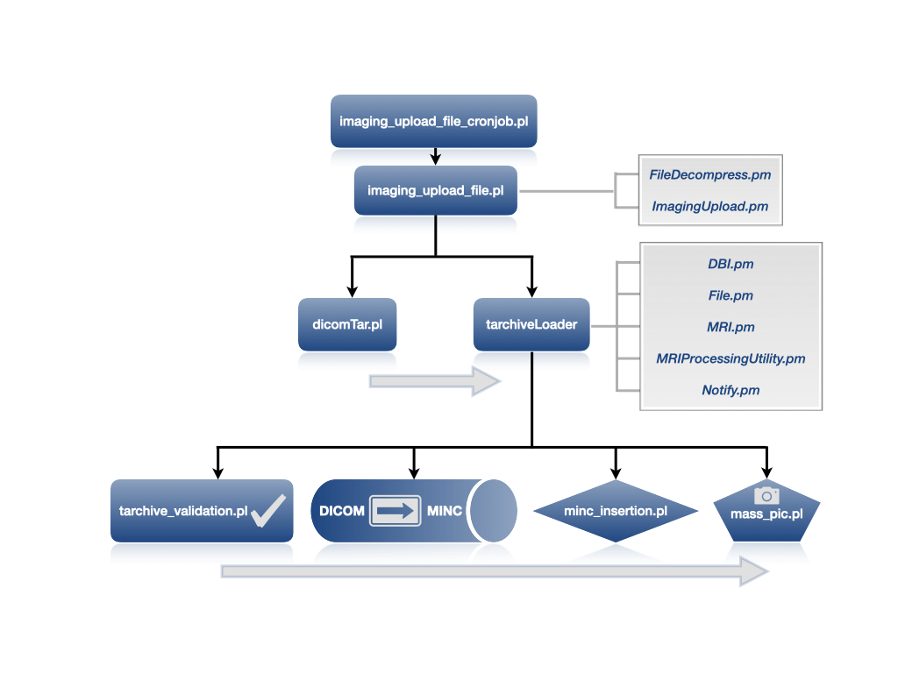
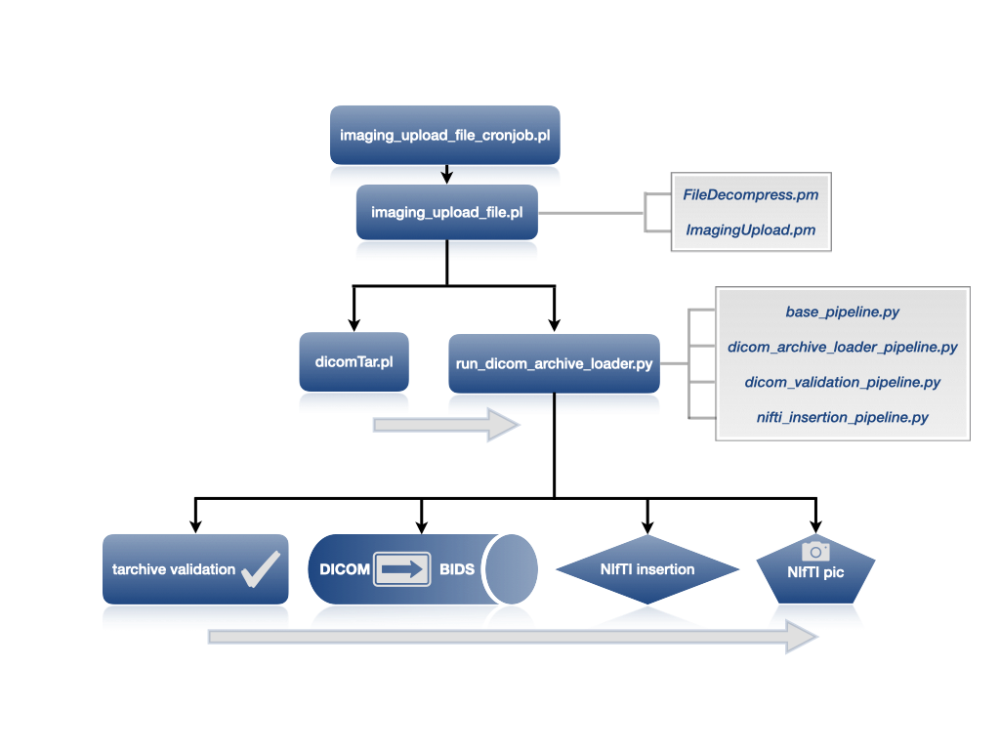

# 4.0 - Scripts

## 4.1 - Perl documentation

All the perl scripts in the LORIS-MRI repository are documented. Users are 
invited to consult the documentation 

- at the terminal by typing:
```angular2html
perldoc %/PATH/TO/THE/SCRIPT/SCRIPT_NAME%
```

- in markdown format, on the [LORIS-MRI repository](../scripts_md/).

Whether at the terminal or on-line, all scripts' documentations follow a used
convention briefly outlined below:

<pre>
package XXXXX

=pod

=head1 NAME

Name of the package or script

=head1 SYNOPSIS

A few lines of code on how to use the package or script

=head1 DESCRIPTION

Overall description of the package or script

=head2 Methods

=cut

use warnings;
use strict;

=pod

=head3 functionName($variable)

Short description of the function.

INPUT: short description of inputs or arguments

RETURNS: short description of the returned objects

=cut
sub functionName{
  ...
}
### REPEAT FUNCTION PART FOR EACH METHOD

1; # end of script

=pod

=head1 TO DO

Nothing planned (or things that are left to do)

=head1 BUGS

None reported (or list of bugs)

=head1 LICENSING

License: GPLv3

=head1 AUTHORS

LORIS community <loris.info@mcin.ca> and McGill Centre for Integrative 
Neuroscience 

=cut

</pre>

## 4.2 - Pipeline flow

### 4.2.1 - DICOM to MINC pipeline flow

A very brief illustration summarizing the main outcomes at different steps in 
the execution of the pipeline are shown below. 



This figure highlights the few 
key scripts in the pipeline execution, the order in which they call each other, 
and their interactions with the diverse libraries and utility classes. It 
therefore serves as a tool to help project developers understand the pipeline
quickly, and develop independently project customizations and debugging skills.

### 4.2.2 - DICOM to BIDS pipeline flow

A very brief illustration of the key and expected outcomes at different steps in
the execution of the pipeline is shown below. 



The DICOM insertion steps are quire similar to the DICOM to MINC pipeline flow. After the 
`dicomTar.pl` step, a python script is executed. That python script will perform
the DICOM archive validation, dcm2niix conversion to generate the BIDS files, 
protocol identification and pic creation.

## 4.3 - Common insertion scripts re-run

The flow in the diagram above corresponds to a new upload. Occasionally, 
however, projects might need to modify (partially or in full) the outcome of an 
inserted scan. The next section highlights the "how-to" of the most commonly 
encountered cases. 

### 4.3.1 Bypassing protocol violation checks

For cases when a scan has triggered a protocol violation, the images can be **force-loaded** into LORIS by running the following scripts:

###### MINC volumes

MINC volumes can be **force-loaded** into LORIS by running:
```
uploadNeuroDB/minc_insertion.pl -acquisition_protocol t2w -bypass_extra_file_checks -create_minc_pics -profile prod -force  -tarchivePath /data/project/dataTransfer/library/2009/DCM_2009-09-25_project_20110214_185904581.tar -mincPath /data/project/data/trashbin/TarLoad-3-34-pVzGC5/xxx0067_703739_v12_20090925_222403_18e1_mri.mnc
```

Note carefully the following arguments:

- `-acquisition_protocol`: must be a known scan type according to the
    `mri_scan_type` table
- `-tarchive_Path`: the DICOM or HRRT tarball
- `-mincPath`: note this file may have been placed in the `trashbin` directory

See also: [MRI-PR#141](https://github.com/aces/Loris-MRI/pull/141) for more
  examples.

###### BIDS use case

NIfTI volumes with their JSON sidecar files can be **force-loaded** into LORIS by running:

```
python/run_nifti_insertion.py --loris_scan_type t2w --bypass_extra_checks --create_pic --profile database_config.py --force  --tarchive_path /data/project/dataTransfer/library/2009/DCM_2009-09-25_project_20110214_185904581.tar --nifti_path /data/project/data/trashbin/TarLoad-3-34-pVzGC5/xxx0067_703739_v12_20090925_222403_18e1_mri.nii.gz --json_path /data/project/data/trashbin/TarLoad-3-34-pVzGC5/xxx0067_703739_v12_20090925_222403_18e1_mri.json
```

Note carefully the following arguments:
- `--loris_scan_type`: must be a known scan type according to the `mri_scan_type` table
- `--tarchive_path`: the DICOM tarball
- `--nifti_path` and `--json_path`: note these files may have been placed in the `trashbin` directory
- `--bval_path` and `--bvec_path`: these files are required for DWI acquisitions so make sure to add those options when calling the script for DWI volumes

### 4.3.2 Rerunning the Imaging pipeline

- If one of the final steps such as the MINC (or BIDS) conversion is failing, you may
    wish to just re-run the `tarchiveLoader.pl` (or `run_dicom_archive_loader.py`) script.
    
> When the need arises to re-load imaging data in LORIS, it is generally not
   sufficient to just re-run the MINC/NIfTI loading step (`tarchiveLoader.pl` or
    `batch_uploads_tarchive`). The pipeline steps must be re-run starting
    with `dicomTar.pl` (see section 5.4 of
   [Pipeline Triggering Options documentation](05-PipelineLaunchOptions.md)).

In general, to re-load an imaging dataset through the pipeline from the start 
   (from `dicomTar.pl`) -- Ensure entries from the previous attempt to load the 
   dataset have been removed from the following database tables:

- `parameter_file`
- `files` (best to delete from this table last)
- `mri_upload`
- `session` - not recommended - only if necessary, and only if no other data is
    associated to this session (*e.g.* on the Behavioural side of LORIS).
- `tarchive`

It is also recommended to remove from the `tarchive` directory the last generated
  `*.tar` package for this dataset, as well as files in the `assembly/`, `assembly_bids/` `pic/`, and `trashbin/` directories.

If any Quality Control flags or comments exist for these scans, you may also
  wish to delete specific records from `files_qcstatus` and the `mri_feedback_*`
  tables, before deleting from the `files` table.

**A script has been created in order to perform a safe deletion of an upload. Please,
see section 4.4 for instructions on how to use the script.**

For backing up, re-labelling and re-loading MRI datasets with QC information,
  see [Beta Tutorial](https://github.com/aces/Loris/wiki/Reloading-MRI-data-for-mislabelled-session)

### 4.3.3 Multiple scanner datasets per session

In cases where a subject was scanned in two scanner sessions as part of the same
  study Timepoint, anonymize both DICOM datasets using the same Visit Label in 
  the Patient Name (or Patient ID) field of the DICOM, and upload as two 
  separate DICOM datasets. The insertion pipeline will automatically 
  associate and display both sets of images acquired in both scanner sessions 
  under the same `session` table record. 
  
## 4.4 - MRI upload deletion script

As of release 21.0 of LORIS-MRI, a deletion script has been added to the tools 
directory of the repository. This deletion script allows to delete completely an MRI 
upload from the filesystem and database or remove specific MINC files derived 
from the MRI upload. Note that by default, all removed data will be backed up.

Detailed information about the script can be found in: 
https://github.com/aces/Loris-MRI/blob/21.0-dev/docs/scripts_md/delete_imaging_upload.md
