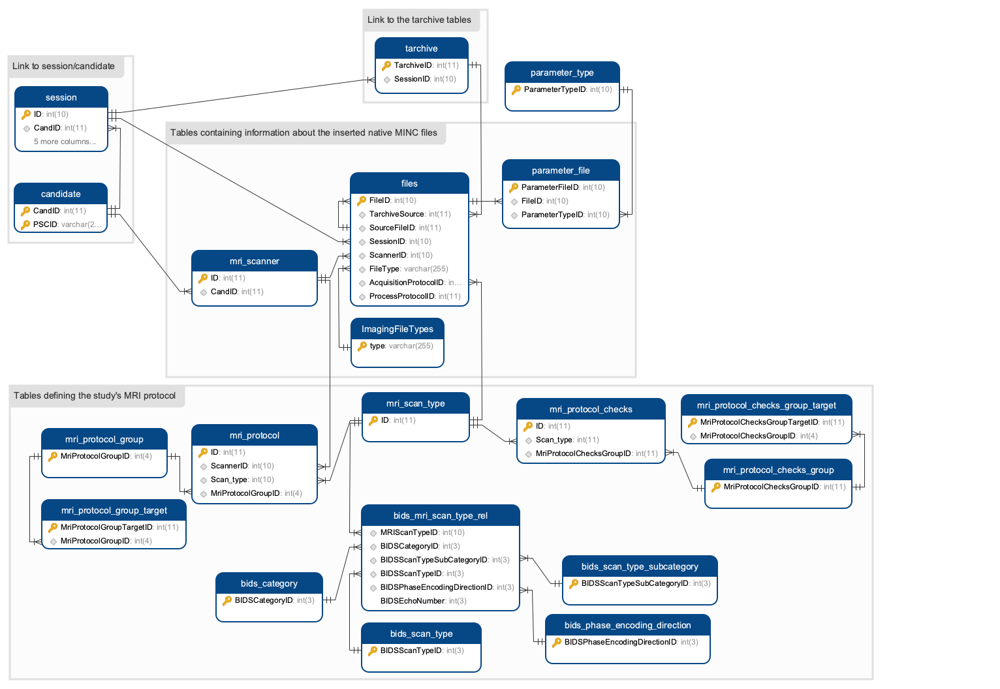
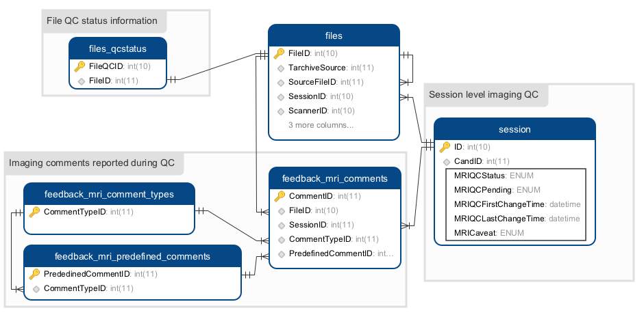
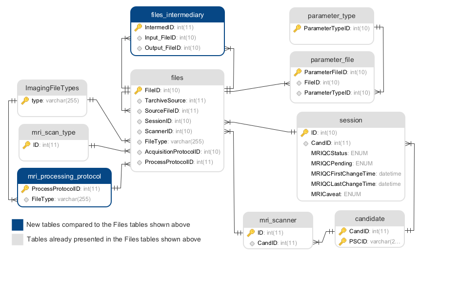

# 4.0 - Technical Infrastructure

## 4.1 Back end directory structure

## 4.2 Database infrastrucure

The database infrastructure is divided in four main components based on the 
  workflow happening from native images insertion to quality control and 
  ultimately insertion of processed datasets:  

1. storage of the DICOM files and their related information
2. storage of the native MINC files and their related information
3. storage of violated scans
4. storage of image quality control information 
5. storage of the processed outputs information

### 4.2.1. DICOM files and their related information

The first step to insert a new imaging session into the database is the 
  insertion of the DICOM study. In the database, all information related to a
  DICOM study is being organized into three different tables:
 
 * the **_tarchive_** table stores information about the whole imaging session,
     including patient, scanner and study information, as well as the location 
     of the archived DICOM dataset. Each row correspond to a specific imaging 
     session identified by the DICOM header _StudyUID_.
 * the **_tarchive\_series_** table stores information about each modality that 
     was acquired during the imaging session (T1W, T2W...). This information 
     include imaging parameters such as TR, TE, TI, slice thickness, sequence 
     name... Each row corresponds to a different modality identified by the 
     DICOM header SeriesUID and EchoTime. This table is linked to the 
     _tarchive_ table via the _TarchiveID_ foreign key.
 * the **_tarchive\_files_** table stores information about each DICOM found in 
     the imaging session. Each row correspond to one DICOM file and is linked 
     to the _tarchive_ table via the _TarchiveID_ foreign key and to the 
     _tarchive\_series_ table via the _TarchiveSeriesID_ foreign key.
 

In the front end of LORIS, you can see the DICOM studies using the 
  _DICOM Archive_ module under the _Imaging_ tab. The information displayed in 
  this module comes from the three tarchive tables mentioned above.

Note: the SessionID field of the tarchive table is populated once at least one 
  MINC file derived from that DICOM study got inserted in the tables described 
  in 4.2.2.

### 4.2.2. Native images information (in MINC)

The second step to insert a new imaging session into the database is the 
  conversion of the DICOM study into the MINC files that will be inserted based 
  on the imaging protocol used. Having the dataset converted in MINC allow 
  visualization of the images directly in the browser.
  
Once all MINC files are created (via the dcm2mnc converter from the minctools), 
  the backend scripts will pull the information stored in the following tables 
  in order to identify the scan type each MINC file created:
  
  * the **_mri\_scan\_type_** table stores the name of the scan type linked 
      along with the ID field that will be used to identify the scan type
  * the **_mri\_protocol_** table stores each scan type's parameters that will 
      be used to identify the scan type (TR, TE, TI, slice_thickness...)
  * the **_mri\_protocol\_checks_** table stores additional protocol checks in 
      order to automatically flag some acquisitions based on information stored
      in specific headers
  
Every MINC file that matches the protocol defined in the tables mentioned above 
  will be inserted in the database using the following tables:
  
  * the **_files_** table contains the information about the MINC file itself 
      (its location, the identified scan type, the file type...). Each row 
      correspond a one MINC file identified by the SeriesUID and EchoTime 
      header information.
  * the **_parameter\_file_** table contains all the information stored in the 
      MINC header. Each row in that table stores a combination of a specific 
      header for a specific MINC file. This table is linked to the _files_ 
      table using the foreign key _FileID_ and to the _parameter\_type_ 
      table using the foreign key _ParameterTypeID_. Note: The parameter type 
      table is automatically populated with the insertion of the first MINC
      file in the database and stores the data dictionary for each MINC header 
      field.
  * the **_ImagingFileTypes_** table contains the different file format that
      can be inserted into the _files_ table (.mnc, .txt, .xml...). The field
      _type_ of the table _ImagingFileTypes_ is linked to the _FileType_ field
      of the _files_ table.
  * the **_mri\_scanner_** table contains information specific to the scanner
      used to obtain the images. By convention, each scanner is assigned a 
      candidate in the candidate table which is linked to the _mri\_scanner_ 
      table using the _CandID_ foreign key. In addition, the _ID_ field of the 
      _mri\_scanner_ table is linked to the _ScannerID_ field of the _files_ 
      table.

Once an image has been inserted into the database, it is possible to view it
  directly via the _Imaging Browser_ module under the _Imaging_ menu. 

### 4.2.3. Violated scans information

In the event a scan does not match any of the protocol mentioned in the 
  _mri_protocol_ table, LORIS automatically flags it as a violated scan.
  Below is the description of the different tables involved in the 
  organization of such scans:
  
  * the **_MRICandidateErrors_** table stores scans for which the _PSCID_ and 
     the _CandID_ fields stored in the PatientName of the DICOMs do not match
     any of the registered candidates in the _candidate_ table. This is linked
     to the _tarchive_ table via the _TarchiveID_ foreign key.
  * the **_mri\_violations\_log_** table ***STORES SOMETHING BUT I DON'T 
      REMEMBER WHAT EXACTLY...***
  * the **_mri\_protocol\_violated\_scans_** table stores the violated scans'
      parameters (TR, TE, TI...) for easy identification of what is different
      between the violated scan and the imaging protocol specified in the 
      _mri\_protocol_ table. ***NOTE: THE LINKS TO THE CANDIDATE TABLE IS A 
      TERRIBLE DESIGN AND THAT TABLE SHOULD LINKED TO THE TARCHIVE TABLE 
      INSTEAD. ISSUE THAT SHOULD BE FIX FOR THE NEXT MINOR RELEASE AFTER 19.0***
  * THE **_violations\_resolved_** table... ***NOTE: THIS TABLE DOES NOT HAVE
      ANY LINK TO THE OTHER TABLES... NEED TO FIX THIS. PROBABLY FOR THE NEXT
      RELEASE TOO***

### 4.2.4. Images quality control (QC)

In the _Imaging Browser_ module, it is possible to view the images via
  _BrainBrowser_ and directly perform quality control of the images. The quality
  control information is then stored in the following tables:
  
  * the **_files\_qcstatus_** table stores the QC status of the MINC file and  
      is linked to the _files_ table via the _FileID_ foreign key. 
  * the **_feedback\_mri\_comments_** table stores all the comments associated
      to a given scan. These comments can be predefined (from the table 
      **_feedback\_mri\_predefined\_comments_** or a text entered by the user 
      based on the comment type stored in **_feedback\_mri\_comment\_types_**).
  * session level QC information are saved in the **_session_** table and  
      session level comments are saved in the **_feedback\_mri\_comments_** 
      table.

### 4.2.5. Processed data information

Any native scan inserted into the files table can be processed and the output
  of this processing can be inserted into the database and linked to the native
  scan. For this, two additional tables require our attention (in light blue in
  the graphic below):
  
  * the **_files\_intermediary_** table allows to link processed data with the
      native datasets (our even intermediary outputs). The _Input\_FileID_ and 
      _Output\_FileID_ fields of that table are links to the _FileID_ field of
      the _files_ table mentioned in section 4.2.2. Note that the native file
      used to create processed outputs is always stored in the files table in 
      the _SourceFileID_ field, which is linked to the _FileID_ field of the
      same table.
  * the **_mri\_processing\_protocol_** table stores the imaging processing 
      protocols used to produce processed data. This table is linked to the
      _files_ table using the _ProcessProtocolID_ foreign key. Additionally,
      the field _FileType_ of the _mri\_processing\_protocol_ table is linked to
      the _type_ field of the _ImagingFileTypes_ table.
  
