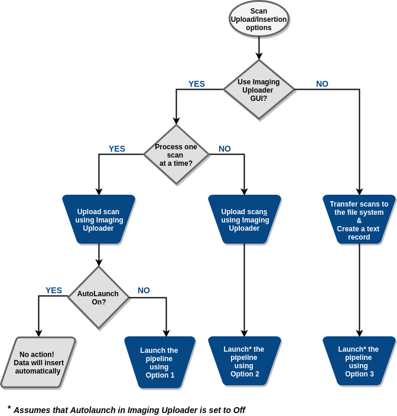

# 5.0 - Pipeline Launch options

## 5.1 - Pipeline Launch Options for DICOM and HRRT datasets

Scans upload into LORIS and insertion pipeline's triggering can be done in a few 
ways depending on each project's needs. The best choice will depend on the study 
workflow and protocol. For example, it will depend on whether data is collected 
retrospectively or prospectively, and/or whether the MRI protocol is harmonized 
across all the sites involved in the study.

The different options available are illustrated in the graph below.



Regardless of how the project chooses to upload scans and trigger the insertion, 
the automated quality control and MRI protocol checks performed by the pipeline 
should remain identical.

It is also worth mentioning that all the options illustrated here assume that 
the candidate and visit are already registered in the LORIS database.


In the next three sub-sections, the three launch options illustrated in the 
figure above will be briefly highlighted and the exact command needed to launch 
the pipeline shown.
Details about the scripts themselves can be found in the [Scripts](04-Scripts.md)
section.
 
### 5.1.1 Option 1

Triggering the pipeline is done from the `/opt/$PROJECT/bin/mri` directory as 
follows:

```
uploadNeuroDB/imaging_upload_file.pl -profile prod -upload_id $UploadIDID /PATH/TO/UPLOAD/PSCID_CandID_VisitLabel_OptionalSuffix.zip -verbose
```

where `$UploadID` is the number corresponding to the `UploadID` column in the 
Imaging Uploader (`mri_upload`) table, and `/PATH/TO/UPLOAD/` is typically the 
`/data/incoming/` directory.

This is a typical option for a project prospectively collecting data with 

1. multiple sites involved, 
2. a designated user per site for collecting scans from the scanner console and 
uploading to LORIS, and 
3. a project's imaging specialist monitoring new uploads, and launching the 
insertion pipeline manually, for every new `UploadID` separately. 

### 5.1.2 Option 2 

Triggering the pipeline from the `/opt/$PROJECT/bin/mri` directory can also be 
achieved as follows: 

```
uploadNeuroDB/imaging_upload_file_cronjob.pl -profile prod -verbose
```
                                
The script `imaging_upload_file_cronjob.pl` does not require a specific 
`$UploadID` as an argument because it automatically cycles through 
*all new uploads* on which the pipeline has not been triggered yet, and 
launches it. As such, this option is used in similar scenarios as Option 1, 
but with the added advantage of not needing to continuously monitor for new 
uploads (the script can be added to the system's crontab to launch at 
pre-scheduled times, as per the project's requirements).


### 5.1.3 Option 3

The insertion pipeline can also be triggered using the command:
```
./batch_uploads_imageuploader -profile prod < scans_list.txt > log_batch_imageuploader.txt 2>&1 

```

This is an option that addresses retrospectively collected data where uploading 
hundreds of scans, one scan at a time, using the LORIS Imaging Uploader 
user-friendly interface is impractical. It is also the option of choice for 
prospective studies that want to benefit from tracking scans through the Imaging 
Uploader while automating the upload and insertion process without a user/GUI 
interface interaction. 

In this case, the scans should be transferred to the LORIS-MRI filesystem (for 
example `/data/incoming/`). In addition, an input text file (such as 
`scans_list.txt`) listing one dataset per line should be provided (see example 
below).

Each line in that text file should include the following information separated 
by spaces:

1. the full path to the zipped DICOM dataset (`.zip`, `.tgz`, `.tar.gz`), 
2. Y or N depending on whether the scan is for a phantom or not, and
3. the patient name following the `PSCID_CandID_VisitLabel` LORIS convention for 
real candidates. Leave BLANK for phantoms.


Example for two entries/scans to be uploaded (one human subject and one phantom):

```
/data/incoming/PSC0001_123456_V1.tar.gz N PSC0001_123456_V1
/data/incoming/Lego_Phantom_MNI_20140101.zip Y
```


## 5.2 - Pipeline Launch for BIDS datasets (if no DICOM files available)

### 5.2.1 - Ideal BIDS structure for LORIS

The BIDS dataset to import has to:

- pass the BIDS validator of [pybids](https://github.com/bids-standard/pybids)
- contain a `participants.tsv` file at its root. Ideally, this file will contain the following columns:
  - `participant_id`: the PSCID of the candidate  
  - `date_of_birth`: the date of birth (in YYYY-MM-DD) to use when creating the candidate in LORIS 
  - `sex`: the sex to use when creating the candidate in LORIS (value examples: `M`/`F` or `female`/`male`)
  - `site`: the MRI alias of the LORIS site to associate the candidate with when creating the candidate in LORIS. This field is optional. If provided, the entry should match the MRI alias of a site already populated in the database. If missing or invalid, NULL will be used instead.
  - `project`: the name of the LORIS project to associate the candidate with when creating the candidate in LORIS. This field is optional. If provided, the entry should match the name of a project already populated in the database. If missing or invalid, NULL will be used instead.
  - `subproject`: the name of the LORIS cohort to associate the candidate with when creating the session in LORIS. This field is optional. If provided, the entry should match the name of a cohort already populated in the database. If missing or invalid, NULL will be used instead.
- contain a `participants.json` that describes the fields present in `participants.tsv`. Example of a `participants.json` if all fields described above for `participants.tsv` are present:

  ```
  {
    "participant_id": {
        "Description": "Unique participant identifier"
    },
    "age": {
        "Description": "Age of the participant at time of testing",
        "Units": "years"
    },
    "sex": {
        "Description": "Biological sex of the participant",
        "Levels": {
            "F": "female",
            "M": "male"
        }
    },
    "site": {
        "Description": "Site of the testing",
        "Levels": {
            "DCC": "Data Coordinating Center",
            "MNI": "Montreal Neurological Intitute"
        }
    },
    "subproject": {
        "Description": "Cohort of the participant",
        "Levels": {
            "IEEG": "IEEG Atlas"
        }
    },
    "project": {
        "Description": "Project of the participant",
        "Levels": {
            "IEEG": "IEEG Atlas"
        }
    }
  }
  ```


In cases where the `site`, `project` or `cohort` are missing from the `participant.tsv` file, `NULL` will be populated for those fields in the candidate and session tables. In those cases, later manual addition is required in order to display the entry on the frontend.


### 5.2.2 - Pipeline Launch 

For now, the only way to run the pipeline is by running the `bids_import.py` 
script manually via the terminal.

To display the help section, run the following in the terminal:
```bash
bids_import.py -h
```

This will display the following help section:

```bash
usage  : bids_import -d <bids_directory> -p <profile> 

options: 
	-p, --profile        : name of the python database config file in dicom-archive/.loris-mri
	-d, --directory      : BIDS directory to parse & insert into LORIS
	-c, --createcandidate: to create BIDS candidates in LORIS (optional)
	-s, --createsession  : to create BIDS sessions in LORIS (optional)
	-v, --verbose        : be verbose
```

To run the BIDS import, simply run:
```bash
bids_import -d /PATH/TO/BIDS/TO/IMPORT -p database_config.py
```

If you wish to create candidates when running the import script, the `-c` 
option needs to be added. To create sessions when running the import script, 
the `-s` option need to be added as well.
```bash
bids_import -d /PATH/TO/BIDS/TO/IMPORT -p database_config.py -c -s
```

Finally, the verbose option can be turned on by using the option `-v` when 
calling the script:
```bash
bids_import -d /PATH/TO/BIDS/TO/IMPORT -p database_config.py -v
```


**Note on the LORIS-MRI Python virtual environment**: in order to be able to 
run `bids_import.py`, you need to be in the loris-mri Python virtual 
environment. It should have been sourced when sourcing your LORIS-MRI 
environment file. If this is not sourced, then simply run the following:
```bash
source /opt/%PROJECT%/bin/mri/python_virtualenvs/loris-mri-python/bin/activate
```
To deactivate a Python virtual environment, simply type `deactivate` in the 
terminal.
